# Full Stack Frameworks with Django Milestone Project


<a href="https://ms4-ukiyo-e.herokuapp.com/" target="_blank">Visit Website</a><br>
Ukiyo-e is an ecommerce site dedicated to selling replica Japanese art prints. Visitors can purchase prints using online payments. Verified Store owners can also sell prints to meet consumer needs. Visitors can browse and search prints easily and intuitively while also gathering additional information on the paintings and artists. Products can also be searched for and users can browse individual artist information and products vias the artists’ section.

### SuperUser Access
For superuser access please use the below username and password. This will provide you with CRUD funcitonality.
-   Username: titilek325
-   Password: pppaptwgb99

## UX

When designing this website, I followed the 5 levels of development, a well know web design process mentioned in Jesse James Garrett's book, The Elements of User Experience. The planning of each of these planes are to follow the same order as below with each plane aligning to the previous plane’s requirements. This ensures that the main objectives for the website identified in the Strategy plane aligns all the way through to the Surface Plane which identifies the actual features on the website.

### Startegy Plane

#### Project Objectives

- Provide information such as artist, period, medium, original dimensions etc. for the specific painting.
- Provide information such as artist era, mediums used and nationality for specific artists.
- Allow for visitors to have the option to purchase any paintings they like.
- Produce an interactive site where users can browse and discover pictures they like.
- Provide users with links to other sites so that they can discover further information on the paintings and artists they enjoy.
- Allow for users to register, login and review their activity such as recent purchases.

#### User Stories

- As a visitor, I would like to browse ukiyo-e paintings, so that I can see if any appeal to me.
- As a visitor, I would like to read information on individual paintings, so that I can  discover more about the piece.
- As a visitor, I would like to browse through a specific artists paintings, so that I can see if any appeal to me.
- As a visitor, I would like to search by keywords, so that I can discover paintings depending on my specific tastes.
- As a visitor, I would like to add items to my basket and purchase, so that I can enjoy the prints in real life.
- As a visitor, I would like to create an account, so that I can keep track of my purchases and activity.
- As a store owner, I would like to add products where needed to allow for the most up to date information and products are supplied for sale.
- As a store owner, I would like to edit products where needed to allow for the most up to date information and products are supplied for sale.
- As a store owner, I would like to delete products where needed to allow for the most up to date information and products are supplied for sale.

### Scope Plane

The scope plane ensures that the website sections align to the objects and that these don’t grow in number throughout the project. Necessary sections which align to the project objectives and user stories mentioned in the Structure plane are chosen. For this project we will include all phase 1 sections and omit phase 2 sections until a later sprint due to resource capacity.

#### Phase 1

The first phase of the website will consist of 12 pages.

-	Home
-	Products
-	Product detail
-	Artists
-	Artist detail
-	About
-	My Profile
-	Shopping bag
-	Checkout
-	Edit Product
-	Login
-	Logout

#### Phase 2

Seeing as the first phase has the functionality for a full working ecommerce site, phase 2 will be focused on creating more of a community environment between users. This includes more personalisation on individual profiles for both sellers and buyers such as a public profile page, ratings for sellers and a feed area with updates from sellers and buyers based on activity they choose to share such as recently purchased products or favourite artists.

-	Product rating
-	Product comments section
-	Artist Rating
-	Artist comments section
-	Users Public Profile page
-	Users Public feed and activity


### Structure Plane

The Structure plane is focused on taking the content selected from the scope plane and outlining how to portray this from a design aspect.

#### Design Process

-	As the website is a collection of both landscape and portrait artworks I decided the best way to deliver this is to input a masonry design in the approach to the products page for desktop and for mobile, displaying individual products inline.
-	I decided to show the price only for each product to avoid excess of text info. Should the user want additional information for any products, they can hover over the product on desktop or click the info button on mobile and the artwork title and artist will appear in a production overlay
-	I decided to base the colour theme for the website off one of the most iconic ukiyo-e artworks, The Great Wave by Hokusai. The image features as the homepage welcome image. The three colours I adopted is the navy, light blue, and gold. I used the navy as the primary colour for font, buttons, and icons throughout, the light blue is used subtly as border and text shadows to add depth to features and finally I used the gold as the border for individual products on the products page as a similar colour feature in the canvas of many of the prints.
-	For the individual product page, I followed a standard ecommerce web design with the image on the left and information and functionality on the right.
-	For Artists, as this was informative only (as opposed to the functionality for product details) I took a different approach and implemented one of the artists images as the background image behind information of the artist which dedicates the pages theme to the artists artwork.
-	I choose a comic book like Neucha font because the artwork featured has influenced Japanese/manga style over the centuries and I feel they complement each other nicely.
-	Font awesome icons were used throughout

### Skeleton Plane

Once the sections and layout has been identified as in the previous planes, we can get started with the Skeleton Plane. The Skeleton Plane outlines the arrangement of each section on the website and the best way to design these are by creating wireframes. I initially drew these wireframes before creating by using Balsamiq software.

#### Index.html
- Desktop

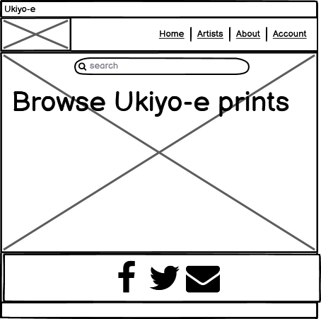

- Mobile

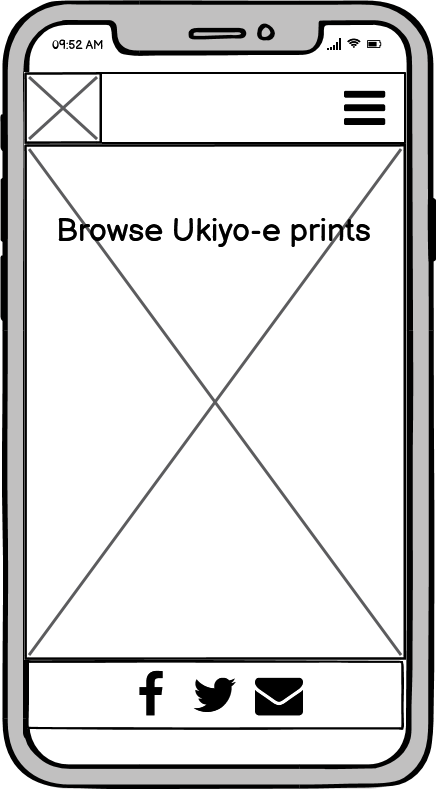

#### Products
- Desktop

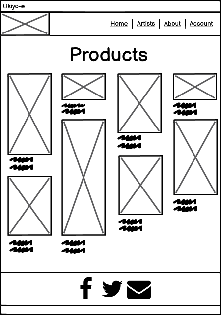

- Mobile

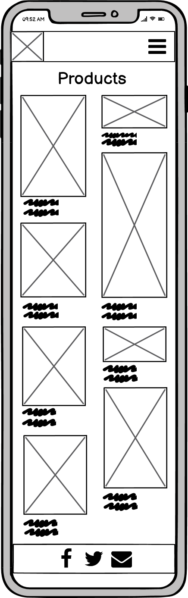

#### Product detail
- Desktop

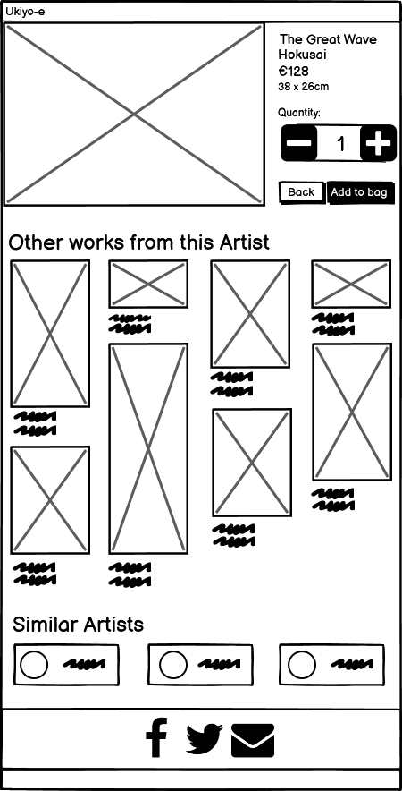

- Mobile

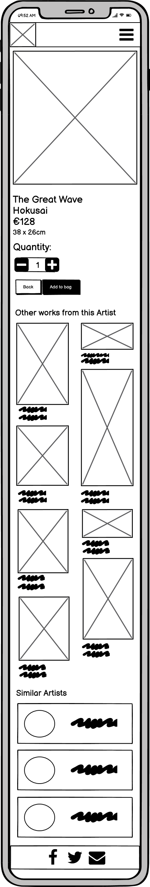

#### Artists
- Desktop

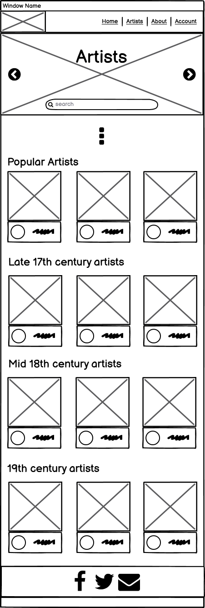

- Mobile

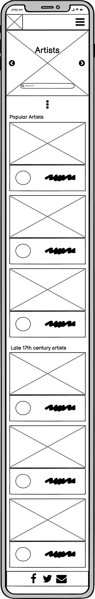

#### Artist detail
- Desktop

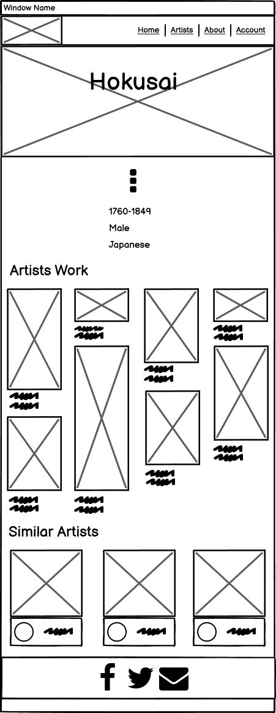

- Mobile


#### About
- Desktop

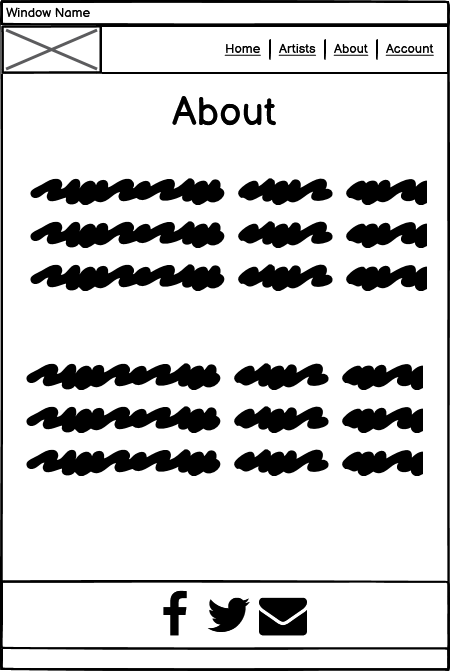

- Mobile

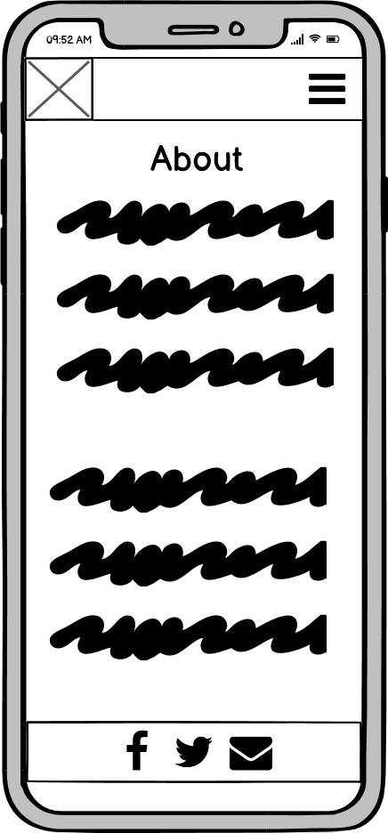


### Surface Plane

The surface plane is the least conceptual plane and consists of the actual content and features on the website.

Features
-	Navbar
-	Search bar
-	Shopping bag
-	Add to bag
-	Quantity
-	My account
-	Form
-	Product info on hover
-	Edit/Add product
-	Purchase
-	Order history
-	Email verification
-	Upload image

#### Apps used to implement this
I created the below list of apps as part of the django framework in creating my website

-   about
-   home
-   bag
-   checkout
-   products
-   profiles

### Technologies Used

-	HTML Used to add content to the website.
-	CSS Used to add structure and design to my site.
-	JavaScript & jQuery Used for the below features
    -   Go to top button
    -   Stripe Integration
    -   Add product +/- quantity buttons 
    -   Reduce image info on low height images
    -   Mobile info appearance
    -    defensive programming alert for the Delete product action
    -   Product Sort selector
-   Python
    -   Python was used for the backend elements of the Website to interact with the database and feed data depending on users’ interactions.
It was also used to integration with Django by creating the views for each app.
-	Django
    -   Allauth
    -   Crispyforms
    -   Django and the Templating Language is used to allow for the high volume of information feed through to the HTML template pages.

-	Heroku / Heroku Postgres
    -   Heroku is used to deploy and host the website.
-	Bootstrap
    -   Bootstrap was used throughout the website to easily implement attractive and consistent designs. The Bootstrap Grid System was implemented throughout.

-	Font Awesome: Below font awesome icons were used
    -   Image
    -   Account
    -   Shopping bag
    -   Edit
    -   Trash
    -   Facebook
    -   Email
    -   Instagram
    -   Location
    -   Telephone
    -   Zoom
    -   Quantity +/-
-	Balsamiq
Used in the design process for wireframes.
-	GitPod
Used to create, commit and push the HTML, CSS, JavaScript and Python changes for the website.
-	GitHub
Used to store files and code on development
-	Amazon Web Services
Used to store files and code on deployment
-	Stackoverflow
Used for problem solving to implement desired website functionality.
Used to gain better understanding of how I should approach the implementation of elements.
-	W3Schools
Used to gather a theoretical knowledge of elements and effects.
-	W3 HTML Validator
Used throughout the project to ensure I was following best practices with HTML code.
-	Jigsaw CSS Validator
Used throughout the project to ensure I was following best practices with CSS code.
-	JSHint JavaScript Validator
Used this GitPod extension throughout the project to ensure I was following best practices with JavaScript code.
-	Kaggle
Used to browse and discover a wealth of databases
-	Google Fonts
Used for font implementation and inspiration.
-   http://techsini.com/
    -   Used for Responsive Theme image at beginning of this ReadME.
-	Stripe
    -   Used as the payment provider to handle the online payments.
-	https://picresize.com/
    -   Used to reduce image quality without affecting the user experiencing while reducing the websites loadtime
-   Excel
    -   Used for cleaning the csv file containing product info from met museum.
    -   Also used for creating the data schema diagram
-   https://jsonformatter.org/
    -   Used to convert CSV data to Json and beautify thereafter.


### Testing

Testing is done in a seperate <a href= "documentation/Testing.md">Testing.md</a> file

### Data Schemes
The database for the products of this project was sourced from the met musuem (further info can be found in the credits section).
The database is stored by Heroku Postgres and the deployment instructions are mentioned in the next section.
The relationship between the products models can be seen in the 
<a href= "media/images/readme/models_data_schema.JPG">Data Schema here</a>
Regarding the relaitonship between the products, artists and Period, I also outlined in the following diagram.
Although no models were created for these, I used python and the product ids to implement these relationships.
The met museum database was rich in data for each product that many relationships could be created.
The period was used a means to categorise the products and artists.

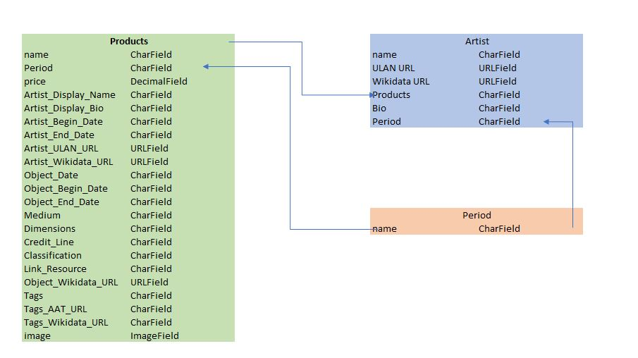

### Deployment 

#### Heroku Deployment

-	Go to Heroku.com
-	Set up and account, create an app with a unique name by following the instructions and enter any relevant information requested.
-	Go to the “Resources” tab and select Heroku Postgres
-	Using the Gitpod terminal enter the below installations

```
pip3 install dj_database_url
pip3 install psycopg2-binary
```

-	Then freeze the requirements with the below command
```
pip3 freeze > requirements.txt
```
-	Go to Settings.py and enter the below at the top
```
Import dj_database_url
```

-	In the database setting of this file, comment out the default configuration and enter the below, with the Heroku DATABASE_URL key found in the apps config variables.

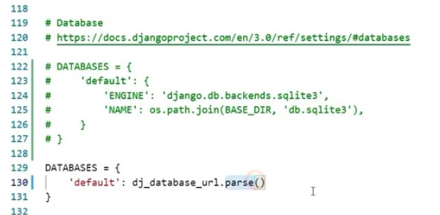

-	Migrate all migrations to heroku by entering 
```
python3 manage.py migrate
```
-	To load the products enter the below command
```
python3 manage.py load data products
```
-	A superuser will be created next to be able to access the admin and ensure relevant permissions are granted.
```
python3 manage.py create superuser
```
-   then enter the login details desired for this account
-	Remove the Heroku DATABASE_URL and uncomment the default configuration before committing.
-	Input the below logic into the settings file so that when a database URL is present we connect to Postgres, otherwise we connect to sqlite.

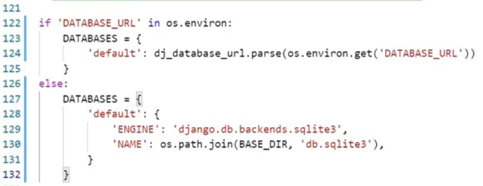

-	Next we’ll need to install gunicorn as our web server and freeze the requirements using the below commands
```
pip3 install gunicorn
pip3 freeze > requirements.txt
```
-	Create a procfile to tell Heroku to create a web dyno which will run gunicorn and serve our Django app.
```
web: gunicorn APP-NAME.wsgi:application
```
-	To ensure Heroku doesn’t try to collect static files when we deploy, login to Heroku using you login when following the below commands
```
Heroku login
Heroku config:set DISABLE_COLLECTSTATIC=1 –app APP-NAME
```
-	Enter the app name and localhost (for gitpod) to the ALLOWED_HOSTS section in settings file below

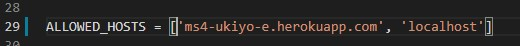

-	We can now deploy the app by adding and committing changes using the below commands and initializing git remote (if needed).
```
git add .
git commit -m “Heroku deployment”
heroku git:remote -a APP-NAME 
git push heroku master
```
-	Next, to ensure automatic github deployemnts are pushed to Heroku, follow the below
    -   Go to the app page in Heroku.
    -   Go to the Deploy section
    -   Search and find the repositories name in the Connect to GitHub section
    -   And then click connect
    -   Then select, “Enable Automatic Deploys”

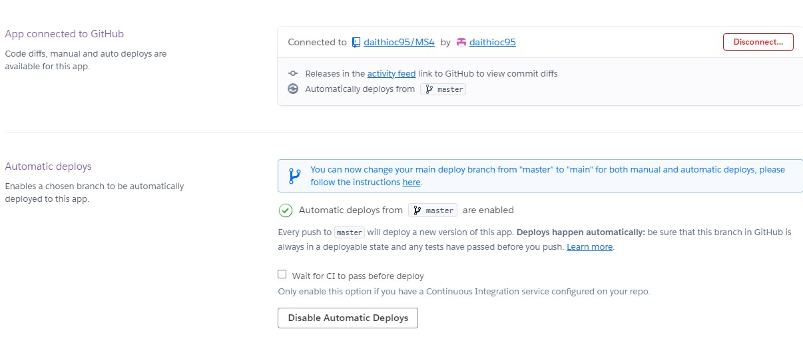

-	You will then need to replace the SECRET_KEY in settings.py with one saved on heroku.
    -   Generate a key
    -   Add to config variables in Heroku

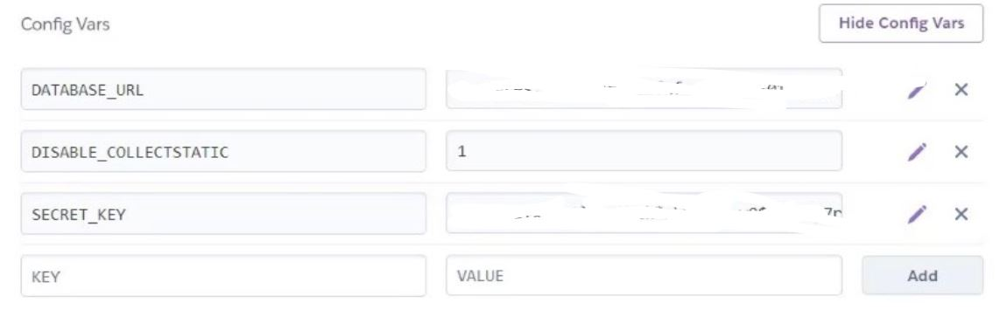

    -   The replace the current SECRET_KEY in settings.py with a call to get the above key like below.

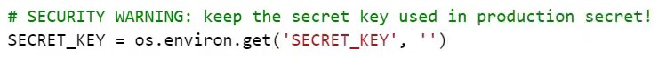

-   Finally, commit and push these changes to github
```
git add .
git commit -m
git push
```

#### AWS Deployment

Deployment to AWS is required which was used to host static files and images.
-	Create an AWS account by going to https://aws.amazon.com/
-	 Once signed in locate S3 via the AWS Management Console
-	When in S3 select, Create Bucket where your files will be stored
-	Unselect “Block all public access” and tick the box acknowledging this to ensure the files are visible to everyone
-	The select “Create Bucket”
-	Open the bucket and turn on “static website hosting” via the properties tab. Enter any default values for index and error documents and click save.
-	Next go to the permissions tab and make the following changes
    -   Go to CORS configuration, paste the below and click save. This will set up the access between the heroku app and this bucket.

```
[
  {
      "AllowedHeaders": [
          "Authorization"
      ],
      "AllowedMethods": [
          "GET"
      ],
      "AllowedOrigins": [
          "*"
      ],
      "ExposeHeaders": []
  }
]
```


-   Go to the Bucket policy tab and select Policy Generater
-   For Select type of policy, enter S3 Bucket Policy
-   Allow all principals by inputing “*”
-   Select the action, Get object.
-   For Amazon Resource Name (ARN), input the value from the Bucket Tab and enter the Name located to the right of “Bucket policy editor”
-   Select “Add Statement”, then “Generate Policy” and the policy will appear.
-   Enter this into the Bucket Policy section back on the S3 buckets page and add a “/*” onto the end of the resource key before clicking save.
-   Finally, under “Access Control List”, select everyone in Public access with the List objects permission before selecting save.
-	Next, we need to create a user to access the S3 bucket.
-	To do this we must first, create a group for the user by clicking groups from the IAM console and entering a name.
-	Click next until you can select “Create Group”
-	Next, we will create a policy for this group by selecting “Policies” on the left hand side and then “create Policy”
-	Go to the JSON tab and select “import managed policy” to import a pre built policy.
-	Search “S3” and select the import the “S3 full access policy”
-	Make a small edit to this policy by entering the previously used bucket ARN and paste it withing brackets within an array like below. Additionally, include an ARN with a “/*” at the end like below.

```
{
    "Version": "2012-10-17",
    "Statement": [
        {
            "Effect": "Allow",
            "Action": "s3:*",
            "Resource": [
                "arn:aws:s3:::ms4-ukiyo-e",
                "arn:aws:s3:::ms4-ukiyo-e/*"
            ]
        }
    ]
}
```

-	Next select “Review Policy”
-	Give it a name and description
-	Then click, “Create Policy”
-	Attach this policy to the group we created by going to “groups”, click the group name, click “attach policy”, search the policy we created, select and attach.
-	Then select a user to go in the group.
-	On the user page, select add user, give them programmatic access and select next until you can click “Create user”.
-	Now click “Download .csv” which includes the users access key and secret access key to authenticate from the Django app.
-	Now that the S3 bucket is created, it’s back to the gitpod terminal to Connect Django to the S3 bucket.
-	Install 2 new packages by inputing the below commands.
```
pip3 install boto3
pip3 install django-storages
```
-	Next, freeze requirements
```
pip3 freeze > requirements.txt
```
-	Go to settings.py and add “storages” to the installed apps section.
-	Enter the below logic into the settings.py file

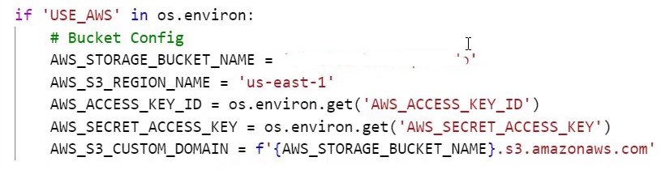

-	Next, add ‘USE_AWS’ and set to true and also add the 2 AWS keys mentioned above to the Heroku config variables as per the csv file while also removing the disable collectstatic variable.
-	Next create a file called custom storages as below

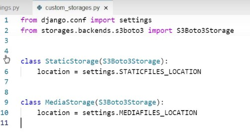

-	Finally in the settings.py file, tell it to save static files to the “staic” location, similarly do the same for media files. Also overide the the URLS for static and media files, as below.

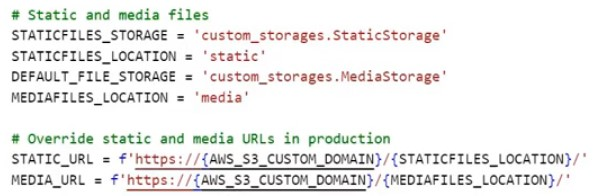

-	 Next add, commit and push these changes to github which will trigger an automatic deployment to heroku.
-	Now that AWS and Django are linked, you can add the image and static files by going to the S3 buckets page and uploading desired files (ensure “grant public read only” is selected)

#### Cloning the project 
If you wish to clone this project, action the following instructions.

-   On the repository "Code" tab, select the "Code" option at the top right.
-   Copy the URL provided in the HTTPS section.
-   Open the GitPod (or favoured environment) terminal and change to the desired directory for the clone to be located.
-   Enter command "git clone" and paste the previously copied URL.
-   Hit enter and the clone will be created.

### Credits

-	 Credit to the Met Museum
    -   All product images and information is credit to Met Museum. Thanks for sharing their database of Art, along with information on each of the product I have uploaded as part of the first iteration. The wealth of information provided by this dataset is what influenced me to choose this topic for my project.
    -   https://www.kaggle.com/kengoichiki/the-metropolitan-museum-of-art-ukiyoe-dataset
    -   https://metmuseum.github.io/

-	Credit to Code institutes, mini project Boutique Ado along with the series of tutorials by Chris Zielinski which was helpful in creating the foundations to work off of.
-   Aknowledgment of code institute tutorials and mini proejcts which helped me in development work
-	Thanks to the Code Institute Tutors for helping me with problem solving throguhout the project and course.
-	Thanks to my mentor, Nishant Kumar for guidance throughout the project and course.
-	Thanks to the Code Institute Slack channel for providing me with a wealth of information on every aspect of the project and course.
-	Aknowledgement of reused elements of my Milestone Project One, Two & Three 
    -   ReadMe which follow similar content, structure and to approach the design process in a similar manner.
    -   The theoretical approach of the UX section was replicated from the previous ReadMe files.
    -   Additionally, I reused some code from these projects, in particularly the CSS as per features below for example footer social links.

-	Bootstrap: Bootstrap was used throughout for grid spacing and designing elements.

#### Please also see some aknowledgement to code which aided me in problem solving

-	low_height_image: function to reduce text margin for low height images
    -   https://stackoverflow.com/questions/21121957/add-class-based-on-height-of-element
-	Footer company details
    -   https://www.web-eau.net/blog/10-best-footer-html-css-snippets
-	Artist card hover font 
    -   https://codepen.io/Itsca/pen/atmGB
-	Arrows used: back to top
    -   https://css-tricks.com/snippets/css/css-triangle/

